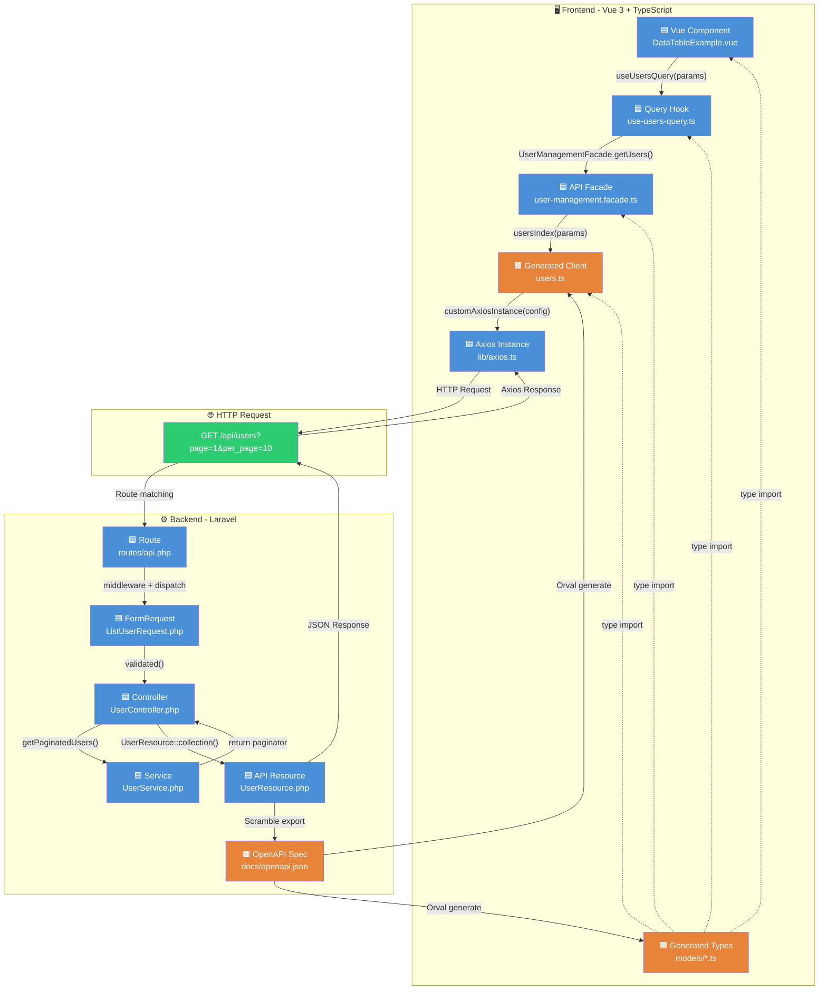
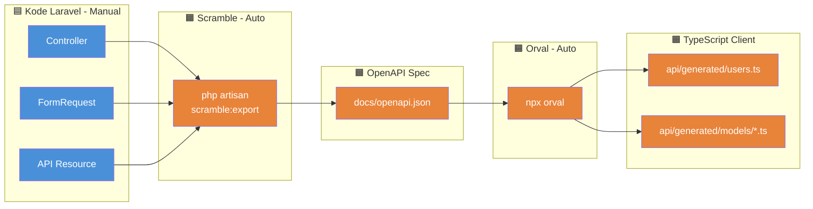

# Alur Request & Response — Vue ↔ Laravel API

## Legenda Warna

| Warna | Keterangan |
|---|---|
| 🟦 **Biru** | **Ditulis programmer** — file yang di-maintain manual |
| 🟧 **Oranye** | **Auto-generated** — dihasilkan oleh Orval atau Scramble, **jangan diedit manual** |
| 🟩 **Hijau** | **Library/Framework** — package yang sudah terinstal (Axios, TanStack Query, Laravel) |

---

## Diagram Alur (Request → Response)



---

## Detail Per Layer

### 1️⃣ Vue Component (🟦 Manual)

**File**: `resources/js/components/custom-ui/data-table/DataTableExample.vue`

Component memanggil query hook atau facade. **Tidak boleh** import generated client atau Axios langsung.

```vue
<!-- ✅ Benar: lewat query hook -->
const { data, isLoading } = useUsersQuery(paramsRef);

<!-- ✅ Benar: lewat facade (untuk non-query) -->
await UserManagementFacade.getUsers(params, signal);

<!-- ❌ Salah: langsung import generated -->
import { usersIndex } from '@/api/generated/users';
```

---

### 2️⃣ Query Hook (🟦 Manual)

**File**: `resources/js/modules/user-management/queries/use-users-query.ts`

Membungkus TanStack Query `useQuery` dengan facade sebagai `queryFn`. Menangani caching, stale time, dan placeholder data.

```typescript
export function useUsersQuery(paramsRef: Ref<UsersIndexParams>) {
  return useQuery({
    queryKey: computed(() => ['users', paramsRef.value]),
    queryFn: ({ signal }) => UserManagementFacade.getUsers(paramsRef.value, signal),
  });
}
```

---

### 3️⃣ API Facade (🟦 Manual)

**File**: `resources/js/modules/user-management/api/user-management.facade.ts`

**Satu-satunya tempat** yang boleh import generated client. Berfungsi sebagai abstraction layer — kalau generated client berubah, cukup update di sini.

```typescript
import { usersIndex } from '@/api/generated/users';

export class UserManagementFacade {
  static async getUsers(params?, signal?): Promise<UsersIndex200> {
    return usersIndex(params, { signal });
  }
}
```

---

### 4️⃣ Generated Client (🟧 Auto-generated oleh Orval)

**File**: `resources/js/api/generated/users.ts`

Di-generate dari `docs/openapi.json`. Berisi fungsi HTTP call yang sudah type-safe.

```typescript
// ⚠️ JANGAN EDIT — file ini di-generate ulang setiap `npm run generate:api`
export const usersIndex = (params?: UsersIndexParams, options?) => {
  return customAxiosInstance<UsersIndex200>({
    url: '/users', method: 'GET', params
  }, options);
};
```

---

### 5️⃣ Generated Types (🟧 Auto-generated oleh Orval)

**Folder**: `resources/js/api/generated/models/`

Type TypeScript yang match 1:1 dengan OpenAPI spec. Contoh:

| File | Isi | Asal |
|---|---|---|
| `usersIndex200.ts` | `{ data, links, meta }` | Response `GET /api/users` |
| `usersIndexParams.ts` | `{ page, per_page, search, sort_by, ... }` | Query params |
| `paginationMeta.ts` | `{ current_page, total, ... }` | Shared pagination |
| `paginationLinks.ts` | `{ first, last, prev, next }` | Shared pagination |
| `userResource.ts` | `{ id, name, email, ... }` | `UserResource.php` |

---

### 6️⃣ Axios Instance (🟦 Manual)

**File**: `resources/js/lib/axios.ts`

Konfigurasi Axios global: `baseURL`, `withCredentials`, interceptor untuk `X-Request-Id` dan error handling.

```typescript
export const customAxiosInstance = <T>(config, options?): Promise<T> => {
  return axiosInstance({ ...config, ...options }).then(({ data }) => data);
};
```

---

### 7️⃣ Route (🟦 Manual)

**File**: `routes/api.php`

```php
Route::get('/users', [UserController::class, 'index'])->name('api.users.index');
```

---

### 8️⃣ FormRequest (🟦 Manual)

**File**: `app/Http/Requests/User/ListUserRequest.php`

Validasi input request. Scramble membaca rules di sini untuk generate parameter schema di OpenAPI.

---

### 9️⃣ Controller (🟦 Manual)

**File**: `app/Http/Controllers/Api/UserController.php`

Orkestrasi saja — tidak ada business logic. Panggil service, return resource.

```php
public function index(ListUserRequest $request): AnonymousResourceCollection
{
    $users = $this->userService->getPaginatedUsers($request->validated());
    return UserResource::collection($users);
}
```

---

### 🔟 Service (🟦 Manual)

**File**: `app/Services/UserService.php`

Business logic murni: query builder, filtering, sorting, pagination.

---

### 1️⃣1️⃣ API Resource (🟦 Manual)

**File**: `app/Http/Resources/UserResource.php`

Mendefinisikan shape response JSON. **Ini yang menjadi source of truth** — Scramble membaca ini untuk generate OpenAPI spec.

```php
return [
    'id'         => $this->id,
    'name'       => $this->name,
    'email'      => $this->email,
    'unit'       => ['name' => $this->unit_name ?? 'Umum'],
    'roles'      => [$this->role ?? 'Staff'],
    'active'     => (bool) $this->is_active,
    'created_at' => $this->created_at?->toIso8601String(),
];
```

---

### 1️⃣2️⃣ OpenAPI Spec (🟧 Auto-generated oleh Scramble)

**File**: `docs/openapi.json`

Di-generate dari kode Laravel (Controller, FormRequest, Resource) oleh Scramble. Ini jadi **input** untuk Orval.

---

## Alur Generate (Code → Spec → Client)



**Command**: `npm run generate:api` = `php artisan scramble:export` → `npx orval`

---

## Mapping File Lengkap

### Frontend

| Layer | File | Tipe | Lokasi |
|---|---|---|---|
| Component | `DataTableExample.vue` | 🟦 Manual | `resources/js/components/custom-ui/data-table/` |
| Query Hook | `use-users-query.ts` | 🟦 Manual | `resources/js/modules/user-management/queries/` |
| API Facade | `user-management.facade.ts` | 🟦 Manual | `resources/js/modules/user-management/api/` |
| Generated Client | `users.ts` | 🟧 Generated | `resources/js/api/generated/` |
| Generated Types | `models/*.ts` | 🟧 Generated | `resources/js/api/generated/models/` |
| Axios Instance | `axios.ts` | 🟦 Manual | `resources/js/lib/` |

### Backend

| Layer | File | Tipe | Lokasi |
|---|---|---|---|
| Route | `api.php` | 🟦 Manual | `routes/` |
| FormRequest | `ListUserRequest.php` | 🟦 Manual | `app/Http/Requests/User/` |
| Controller | `UserController.php` | 🟦 Manual | `app/Http/Controllers/Api/` |
| Service | `UserService.php` | 🟦 Manual | `app/Services/` |
| API Resource | `UserResource.php` | 🟦 Manual | `app/Http/Resources/` |
| OpenAPI Spec | `openapi.json` | 🟧 Generated | `docs/` |

---

## Aturan Penting

> **⚠️ CAUTION**: File 🟧 oranye JANGAN diedit manual! Setiap perubahan akan hilang saat regenerate.

> **❗ IMPORTANT — Alur perubahan yang benar:**
> 1. Ubah kode Laravel (Controller, FormRequest, Resource) — ini source of truth
> 2. Jalankan `npm run generate:api` — Scramble + Orval regenerate
> 3. Frontend otomatis dapat type baru — tidak perlu tulis type manual

> **💡 TIP**: Component Vue tidak boleh import langsung dari `@/api/generated/`. Semua akses data harus lewat **API Facade** → supaya ada satu titik kontrol jika generated client berubah.
